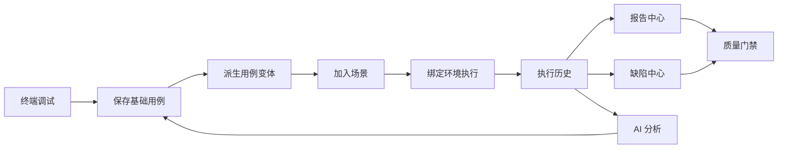

# 核心业务链路与数据流

## 1. 主链路

## 2. 数据对象

### DebugRequest

表示一次终端请求草稿。

字段：

- id
- method
- url
- query_params
- headers
- cookies
- auth_config
- body_type
- body
- environment_id
- created_by
- created_at

流向：

- DebugResult
- TestCase
- ScenarioStep

### DebugResult

表示一次调试执行结果。

字段：

- id
- debug_request_id
- status_code
- response_headers
- response_body
- duration_ms
- error_message
- created_at

流向：

- TestCase.latest_response
- AssertionSuggestion
- ExecutionHistory

### TestCase

表示基础接口用例。

字段：

- id
- folder_id
- name
- description
- method
- url
- query_params
- headers
- cookies
- auth_config
- body_type
- body
- expected_status
- source_type
- source_debug_id
- status
- created_by
- created_at
- updated_at

流向：

- CaseVariant
- ScenarioStep
- ExecutionHistory

### CaseVariant

表示基础用例的测试分支。

字段：

- id
- case_id
- name
- variant_type
- override_params
- override_headers
- override_body
- expected_status
- expected_schema
- assertions
- status
- created_by
- created_at

流向：

- ScenarioStep
- ExecutionHistory
- CoverageMetric

### Scenario

表示业务场景。

字段：

- id
- name
- description
- status
- version
- created_by
- created_at

流向：

- ScenarioStep
- ScenarioRun

### ScenarioStep

表示场景中的一步。

字段：

- id
- scenario_id
- case_id
- variant_id
- name
- sort_order
- enabled
- retry_count
- timeout_ms
- failure_strategy
- extract_rules
- inject_rules

流向：

- ExecutionStep

### ExecutionRun

表示一次用例或场景执行。

字段：

- id
- run_type
- target_id
- environment_id
- status
- started_at
- finished_at
- duration_ms
- summary
- created_by

流向：

- Report
- Defect
- QualityGate
- AIAnalysis

## 3. 执行快照

每次执行必须保存快照，不能只保存引用 ID。

必须快照：

- 环境变量
- 请求 URL
- 请求方法
- 请求头
- 请求体
- 断言规则
- 用例版本
- 场景版本
- 响应状态
- 响应头
- 响应体
- 日志

原因：历史结果必须可追溯，不能因为后续修改用例或环境导致历史失真。

## 4. 模块联动

| 来源 | 目标 | 动作 |
|------|------|------|
| 终端调试 | 用例中心 | 保存为基础用例 |
| 终端调试 | 场景编排 | 追加为场景步骤 |
| 终端调试 | AI 中枢 | 生成断言建议 |
| 用例中心 | AI 中枢 | 生成变体 |
| 用例中心 | 场景编排 | 选择用例或变体作为步骤 |
| 场景编排 | 执行历史 | 场景执行 |
| 执行历史 | 报告中心 | 生成报告 |
| 执行历史 | 缺陷中心 | 失败创建缺陷 |
| 执行历史 | AI 中枢 | 失败归因 |
| 报告中心 | 质量门禁 | 计算放行结果 |
| 缺陷中心 | 质量门禁 | 高危缺陷阻断 |

