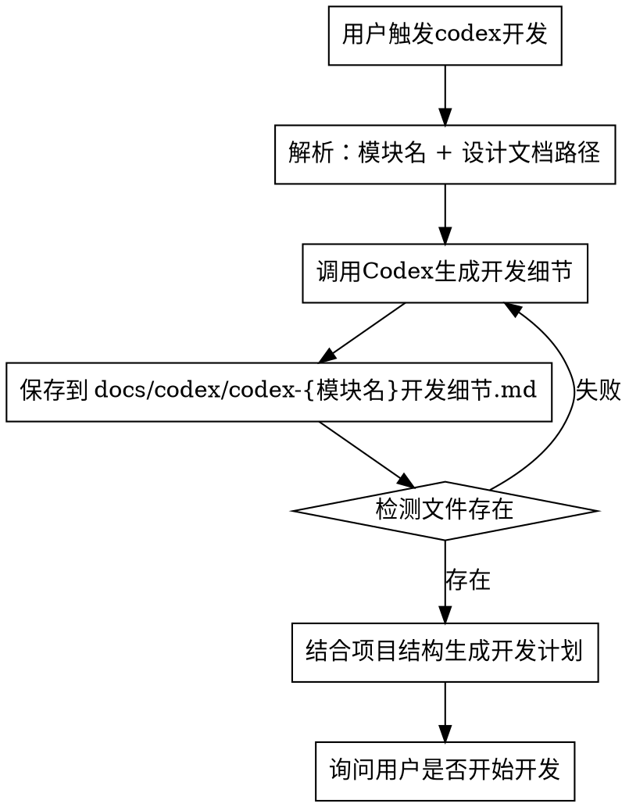

# Codex-Guided-Dev 设计规范

## Overview

用户通过Codex CLI调用专业AI，基于系统设计方案和模块详细设计方案生成开发细节文档，然后Claude基于该文档结合现有项目进行详细开发。实现"设计→开发细节生成→代码实现"的自动化流程。

**核心价值：** 确保开发细节严格遵循设计文档，不凭空杜撰。

## When to Use

**触发关键词：** 用户说"用codex帮我设计XXX模块"、"基于codex开发XXX"

**前置条件：**
- 用户提供了系统设计方案（路径）
- 用户提供了模块详细设计方案（路径）
- 用户指定了模块名称

**流程图：**


## Workflow

### Step 1: 解析用户需求

用户输入示例：
```
用codex帮我设计终端模块，参考文档：
- 系统设计方案：docs/系统设计.md
- 模块详细设计：docs/终端模块详细设计.md
```

Claude解析：
- **模块名称：** 终端模块
- **系统设计方案路径：** `docs/系统设计.md`
- **模块详细设计路径：** `docs/终端模块详细设计.md`

### Step 2: 调用Codex生成开发细节

**输出文件路径：** `docs/codex/codex-{模块名}开发细节.md`

**Codex Prompt模板：**
```
# 任务：基于设计文档生成{模块名}的详细开发方案

## 系统设计背景
请阅读以下系统设计方案：
{系统设计方案内容}

## 模块详细设计
请阅读以下模块详细设计方案：
{模块详细设计内容}

## 要求
基于上述两份文档，生成详细的开发细节文档，包含：

1. **API接口设计**
   - 路由定义（HTTP方法、路径）
   - 请求参数（路径参数、查询参数、请求体）
   - 响应格式（成功/失败）
   - 状态码说明

2. **数据模型设计**
   - 数据库表结构
   - 字段定义（类型、约束、说明）
   - 关联关系

3. **业务逻辑流程**
   - 核心业务流程
   - 服务层逻辑
   - 业务规则

4. **错误处理方案**
   - 异常类型定义
   - 错误码规范
   - 容错处理

5. **前端组件设计**
   - 页面组件结构
   - 组件接口定义
   - 状态管理方案

## 输出格式
生成完整的Markdown文档，严格遵循设计文档的约束，不要凭空添加设计。
```

### Step 3: 验证文件生成

Claude检测 `docs/codex/codex-{模块名}开发细节.md` 是否存在：
- 存在：继续Step 4
- 不存在：提示用户Codex执行失败，可重试

### Step 4: 分析现有项目结构

Claude读取：
- 项目的模块结构（如 `backend/app/`、`frontend/src/`）
- 现有的路由定义
- 已有的数据模型
- 代码规范文档

### Step 5: 生成开发计划

Claude结合：
- Codex生成的开发细节文档
- 现有项目结构
- 代码规范

生成详细的开发计划，包含：
- 需要创建/修改的文件列表
- 每个文件的具体改动点
- 开发顺序建议

### Step 6: 执行开发

用户确认后，按计划执行开发。

## File Structure

```
docs/
  superpowers/
    specs/
      2026-05-19-codex-guided-dev-design.md  # 本文档
  codex/
    codex-{模块名}开发细节.md  # Codex生成
```

## Codex Prompt 变量说明

| 变量 | 来源 | 说明 |
|------|------|------|
| `{模块名}` | 用户指定 | 中文模块名称 |
| `{系统设计方案内容}` | 用户提供 | 从指定路径读取 |
| `{模块详细设计内容}` | 用户提供 | 从指定路径读取 |

## Common Mistakes

| 错误 | 正确做法 |
|------|----------|
| Codex凭空设计 | 必须提供系统设计+模块详细设计两份文档 |
| 生成后不验证文件 | 必须检测文件是否成功生成 |
| 脱离现有项目结构开发 | 必须先分析现有代码再生成计划 |
| 跳过用户确认直接开发 | 必须询问用户是否开始开发 |

## Skill文件位置

```
~/.claude/skills/codex-guided-dev/
  SKILL.md    # 主技能文件
```

## 注意事项

1. **设计文档是必需输入**，不是可选
2. **Codex不能凭空创造**，所有设计必须来源于提供的文档
3. **文件路径使用正斜杠** `/`，跨平台兼容
4. **模块名称用于文件命名**，应简洁清晰
